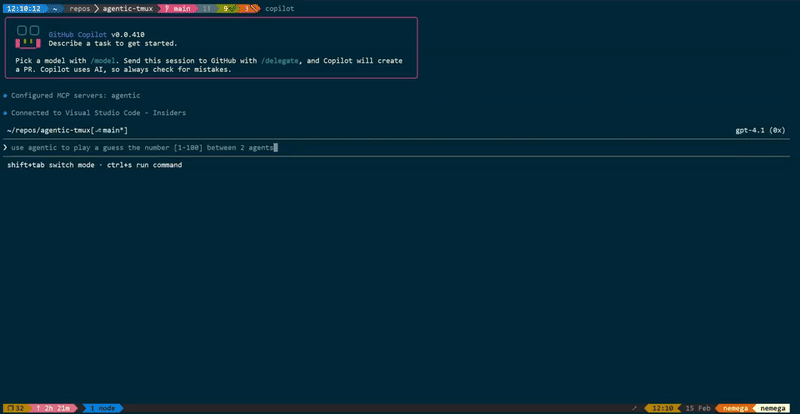
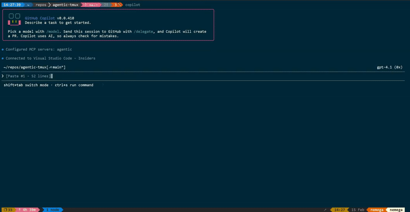
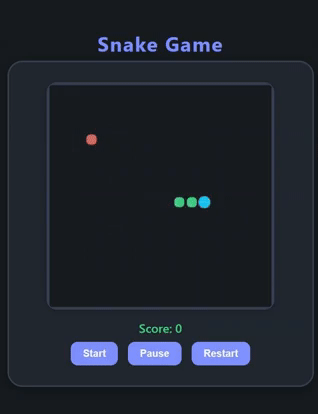

*This is a submission for the [GitHub Copilot CLI Challenge](https://dev.to/challenges/github-2026-01-21)*

## What I Built

**Agentic TMUX MCP** — a multi-agent orchestration system for GitHub Copilot CLI that runs multiple AI agents in parallel tmux panes.

The idea is simple: instead of one AI doing everything sequentially, you describe the work and agents split it up. Each agent runs in its own tmux pane, so you can literally watch them think, code, and talk to each other in real-time.

What makes this different from other multi-agent setups:

- **One prompt is all it takes.** You tell Copilot CLI what you want done. It spawns the agents, assigns tasks, collects results. You just watch.
- **Agents talk directly to each other.** No round-tripping through a coordinator. Agent Coder can message Expert directly via message queues. This keeps context windows small and eliminates the "middle man" bottleneck where a coordinator has to relay everything.
- **Full transparency.** Every agent runs in a visible tmux pane. You see exactly what each agent is doing — their thought process, tool calls, file edits, everything. No black box.

### How It Works

```
You: "Spawn 2 agents: a coder and a reviewer.
      Build an HTML snake game together."
         │
         ▼
┌─────────────────────────────────────────┐
│          Agentic MCP Server             │
│     Spawns panes · Routes messages      │
└─────────┬───────────────────┬───────────┘
          ▼                   ▼
   ┌─────────────┐    ┌─────────────┐
   │  Pane: W1   │◄──►│  Pane: W2   |
   │  Coder      │    │  Reviewer   │
   │  copilot -i │    │  copilot -i │
   └─────────────┘    └─────────────┘
         ▲  Direct messaging  ▲
         └────────────────────┘
```

The agents communicate through lightweight message queues (SQLite by default — no external services needed). Each agent has MCP tools to `send_to_agent()`, `receive_message()`, and `list_agents()`. They coordinate autonomously.

### Why Direct Communication Matters

Most multi-agent frameworks funnel everything through a central orchestrator. Agent A finishes → sends results to coordinator → coordinator summarizes → forwards to Agent B. Every hop burns context tokens and loses details.

With Agentic TMUX, Agent A sends directly to Agent B. The full message arrives without summarization or token overhead. This matters when agents need to iterate — a code reviewer and coder going back and forth 5 times would require 10 coordinator round-trips in a traditional setup. Here, they just talk.

## Demo

### Demo 1: Guess the Number

Two agents play a number-guessing game. One picks a secret number between 1–100, the other guesses. They communicate back and forth with "higher/lower" hints until the number is found.



**The prompt:**
> Use agentic to play of game of guess the number [1-100] between 2 players

---

### Demo 2: Snake Game (Coder + Reviewer)

A coder agent builds an HTML/JS snake game from scratch. A reviewer agent inspects each iteration, suggests improvements, and approves the final version.



**The prompt:**
> Use agentic to spawn 2 agents. Agent 1 is a frontend developer who builds an HTML/JS snake game. Agent 2 is an expert code reviewer who reviews each iteration and suggests improvements. They go back and forth until the reviewer approves.

**What actually happened:**

> **Expert → Coder:** Here are the review criteria: modern visuals with smooth animations, responsive controls, smooth interpolated movement, cross-device support, and well-commented single-file code.
>
> **Coder → Expert:** Confirmed. Beginning implementation.
>
> *— Coder codes —*
>
> **Coder → Expert:** Initial implementation submitted. Ready for review.
>
> **Expert → Coder:** Six items to fix — add food/snake animations and board grid, pause button visual state, interpolated movement instead of grid-jumping, reduce shadow blur on mobile, add minimum playable area with dynamic scaling, group code with section headers.
>
> **Coder → Expert:** All 6 items acknowledged. Updating now.
>
> *— Coder updates —*
>
> **Expert → Coder:** Re-review complete. Visually polished, smooth animations, excellent UX. **No further improvements required. Approved.**

**The final game:**



Note that this was made with GPT-4.1 (free model!)

---

**Repo:** [github.com/negaga53/agentic-tmux](https://github.com/negaga53/agentic-tmux)

## My Experience with GitHub Copilot CLI

Building Agentic TMUX was a case of using Copilot CLI to build a tool *for* Copilot CLI. The entire system is an MCP server that extends what Copilot CLI can do — giving it the ability to spawn copies of itself in tmux panes and coordinate them.

Copilot CLI was the primary development tool throughout. It helped scaffold the MCP server, implement the SQLite storage layer, build the Rich-based monitoring dashboard, and debug the tricky parts of tmux pane management (getting environment variables to propagate correctly through shell commands sent to panes was surprisingly finicky).

The most interesting part was discovering how well Copilot CLI works as an *agent* in multi-agent scenarios. When given clear instructions via the `AGENTS.md` protocol file and MCP tools for messaging, it reliably follows the discover → execute → report → poll workflow. The agents don't need hand-holding — they call `list_agents()`, do their work, send results, and wait for further instructions.
