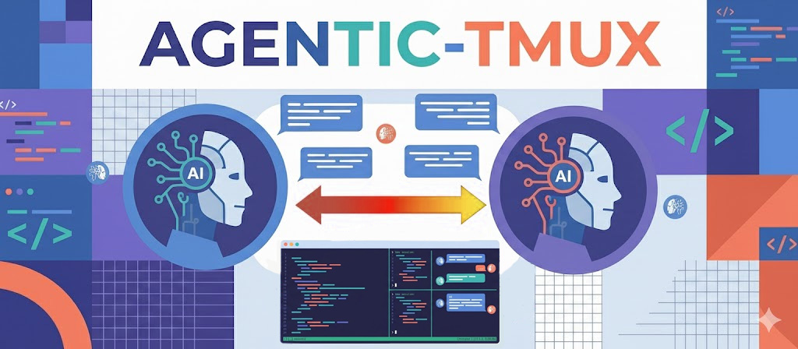

# Agentic TMUX MCP



> Spawn multiple AI agents in tmux panes. They work in parallel, talk to each other, and report back.

Works with **GitHub Copilot CLI** and **Claude Code**.

---

## What It Does

You tell your AI assistant to split work across agents. Each agent runs in its own tmux pane — you can watch them all work in real-time.

```
┌─────────────────────────────────────────────────────────────┐
│              You (Copilot CLI / Claude Code)                │
│        "Spawn 3 agents to refactor, test, and review"      │
└──────────────────────────┬──────────────────────────────────┘
                           │ MCP
                           ▼
┌─────────────────────────────────────────────────────────────┐
│                    Agentic MCP Server                       │
│              Spawns agents · Routes messages                │
└──────────┬──────────────────┬──────────────────┬────────────┘
           ▼                  ▼                  ▼
    ┌────────────┐     ┌────────────┐     ┌────────────┐
    │  Pane: W1  │ ←──→│  Pane: W2  │ ←──→│  Pane: W3  │
    │ Refactor   │     │ Write tests│     │ Review code│
    └────────────┘     └────────────┘     └────────────┘
```

- Agents run in **visible tmux panes** — watch them work
- Agents **communicate via message queues** — not just text
- Works **offline with SQLite** — Redis optional
- **Auto-cleanup** — each `start_session` wipes the previous one

---

## Install

```bash
pip install agentic-tmux
```

**Prerequisites:** tmux, Python 3.11+, and either [GitHub Copilot CLI](https://githubnext.com/projects/copilot-cli/) or [Claude Code](https://www.anthropic.com/claude-code).

<details>
<summary>Other install methods</summary>

**From source:**
```bash
git clone https://github.com/negaga53/agentic-tmux
cd agentic-tmux
pip install -e .
```

**Setup script** (checks prerequisites + configures MCP):
```bash
curl -fsSL https://raw.githubusercontent.com/negaga53/agentic-tmux/main/setup.sh | bash
```
</details>

---

## Configure MCP

Run `agentic-tmux setup` or add manually:

<table>
<tr><th>Copilot CLI</th><th>Claude Code</th></tr>
<tr>
<td>

`~/.copilot/mcp-config.json`
```json
{
  "mcpServers": {
    "agentic": {
      "type": "local",
      "tools": ["*"],
      "command": "agentic-tmux",
      "args": ["mcp"]
    }
  }
}
```

</td>
<td>

`~/.claude.json`
```json
{
  "mcpServers": {
    "agentic": {
      "command": "agentic-tmux",
      "args": ["mcp"]
    }
  }
}
```

</td>
</tr>
</table>

---

## Usage

```bash
# 1. Start tmux
tmux new -s work

# 2. Start your AI tool
copilot -i   # or: claude

# 3. Ask it to use agentic
```

**Example prompt:**
> Use agentic to play of game of guess the number [1-100] between 2 players.

**Monitor from another terminal:**
```bash
agentic-tmux monitor     # Interactive dashboard
agentic-tmux status -w   # Simple status view
```

---

## CLI Commands

```bash
agentic-tmux setup          # Configure MCP
agentic-tmux doctor         # Check system health
agentic-tmux monitor        # Interactive dashboard
agentic-tmux status --watch # Live status
agentic-tmux logs W1 -f     # Follow agent logs
agentic-tmux stop           # Stop current session
agentic-tmux mcp            # Start MCP server (usually automatic)
```

---

## How Agents Communicate

Each agent automatically receives instructions to:

1. **Discover** other agents → `list_agents()`
2. **Execute** their task
3. **Report** results → `send_to_agent("orchestrator", results)`
4. **Poll** for follow-up instructions until terminated

Communication flows through message queues (SQLite or Redis), not text output. This makes inter-agent messaging reliable.

---

## Configuration

| Variable | Default | Description |
|----------|---------|-------------|
| `AGENTIC_REDIS_HOST` | localhost | Redis host (optional) |
| `AGENTIC_REDIS_PORT` | 6379 | Redis port |

Without Redis, storage is `.agentic/agentic.db` in your project directory — automatically cleaned on each new session.

---

## Troubleshooting

| Problem | Fix |
|---------|-----|
| `agentic-tmux: not found` | Add `$HOME/.local/bin` to `PATH` |
| Agents not spawning | Make sure you're inside tmux: `tmux new -s work` |
| MCP tools not appearing | Restart your CLI after adding MCP config |
| Agents not communicating | Run `agentic-tmux doctor` to check health |

---

## Demos

### Guess the Number

Two agents play a number-guessing game. One picks a number 1–100, the other guesses.


---

### Snake Game (Coder + Reviewer)

A coder agent builds an HTML snake game while a reviewer provides feedback. They iterate until the reviewer approves.


**Agent conversation (from real activity log):**

> **W2 → W1:** Here are the review criteria: modern visuals with smooth animations, responsive controls, smooth interpolated movement, cross-device support, and well-commented single-file code.
>
> **W1 → W2:** Confirmed. Beginning implementation.
>
> *— W1 codes —*
>
> **W1 → W2:** Initial implementation submitted. Ready for review.
>
> **W2 → W1:** Adding subtle food/snake animations and board grid. Pause button needs visual state indicator. Snake movement should be interpolated, not grid-jumping. Reduce shadow blur on mobile. Add minimum playable area with dynamic scaling. Group code with section headers.
>
> **W1 → W2:** All 6 items acknowledged. Updating now.
>
> *— W1 updates —*
>
> **W2 → W1:** Re-review complete. Visually polished, smooth animations, excellent UX. **No further improvements required. Approved.**

**Final result:**


Note that this was made with GPT-4.1 (free model!)

---

## Development

```bash
pip install -e ".[dev]"
pytest
```

## License

MIT
